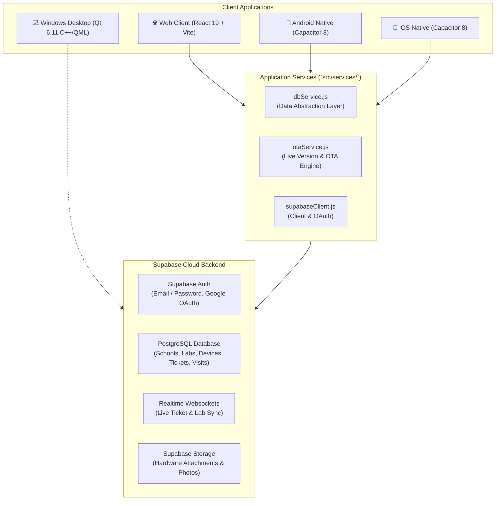

# CampusCare 🏫💻
> **Enterprise IT Asset, Physical Computer Lab & AMC Management System for Educational Institutions**

[](https://github.com/reddotorg123/CampusCare/actions/workflows/ci.yml)
[](public/version.json)
[](https://react.dev/)
[](https://vitejs.dev/)
[](https://capacitorjs.com/)
[](https://supabase.com/)
[](https://www.qt.io/)

---

## 📌 Overview

**CampusCare** is a cross-platform institutional IT service and Annual Maintenance Contract (AMC) management platform designed specifically for schools, colleges, and university computer laboratories.

It unifies hardware monitoring, interactive visual computer lab topology maps, technician dispatch, ticket escalation lifecycles, spare parts inventory tracking, and institutional reporting across Web, Android, iOS, and Windows Desktop clients.

---

## 🏛️ System Architecture



---

## 📂 Repository Directory Organization

This repository is structured following enterprise organization standards for multi-platform development:

```
CampusCare/
├── .github/                     # GitHub Configuration & Automation
│   ├── ISSUE_TEMPLATE/          # Issue templates for bugs and features
│   ├── workflows/               # CI/CD Workflows (CI lint & build, iOS IPA build)
│   └── pull_request_template.md # Standard PR checklist and template
├── android/                     # Native Android project (Capacitor wrapper & Gradle)
│   ├── app/src/main/            # AndroidManifest.xml, icons, native configs
│   └── build.gradle             # Android build specifications
├── ios/                         # Native iOS project (Capacitor wrapper & Xcode)
│   └── App/                     # Xcode project, Info.plist, Podfile
├── public/                      # Static assets distributed with client
│   ├── favicon.ico              # App favicon
│   └── version.json             # Live version registry for OTA update engine
├── qt-client/                   # Native Windows Desktop Client
│   ├── src/                     # C++ backend logic & network handlers
│   └── qml/screens/             # QML user interface views
├── src/                         # Core Web & Hybrid Mobile Application
│   ├── assets/                  # High-res logos, brand artwork & icons
│   ├── components/              # Modular React UI components
│   │   ├── CampusCareCreateTicket.jsx   # Ticket submission with camera support
│   │   ├── CampusCareDashboard.jsx      # Institutional KPI & analytics dashboard
│   │   ├── CampusCareLabEditor.jsx      # Drag-and-drop computer lab visual editor
│   │   ├── CampusCareLabMap.jsx         # Interactive real-time computer lab floor plan
│   │   ├── CampusCareLogin.jsx          # Institutional authentication & Google OAuth
│   │   ├── CampusCareTechnicianJob.jsx  # Technician on-site job sheet & billing
│   │   ├── CampusCareTicketDetails.jsx  # Detailed ticket timeline & chat audit
│   │   ├── CampusCareTicketsList.jsx    # Filterable ticket queue & search
│   │   ├── OtaUpdateModal.jsx           # Cross-platform OTA update prompt
│   │   └── ...                          # Auxiliary modals & sheets
│   ├── data/                    # Local fallback fixtures and lab data
│   ├── services/                # Backend API connectors (dbService, otaService)
│   ├── styles/                  # Clean modern CSS styling tokens & stylesheets
│   ├── App.jsx                  # Main application orchestrator & router
│   ├── index.css                # Global design system & Tailwind/Vanilla tokens
│   ├── main.jsx                 # Application entry point
│   └── supabaseClient.js        # Supabase client singleton & Auth helper
├── supabase/                    # Database Architecture & Cloud Migrations
│   ├── schema.sql               # Complete PostgreSQL schema (DDL, RLS policies)
│   ├── seed.sql                 # Demonstration seed data for testing
│   └── README.md                # Database setup & deployment manual
├── .env.example                 # Environment variable template for team onboarding
├── .gitignore                   # Multi-platform gitignore (Node, Android, iOS, Qt)
├── capacitor.config.json        # Capacitor cross-platform configuration
├── package.json                 # Project dependencies & npm scripts
└── README.md                    # Project documentation
```

---

## ⚡ Quick Start for Developers

### 1. Prerequisites
- **Node.js** (v20 or higher recommended)
- **npm** (v10 or higher)
- **Git**

### 2. Setup
```bash
# 1. Clone the repository
git clone https://github.com/reddotorg123/CampusCare.git
cd CampusCare

# 2. Install dependencies
npm install

# 3. Configure environment variables
# Copy .env.example to .env
cp .env.example .env
# (or on Windows PowerShell)
Copy-Item .env.example .env

# 4. Start local development server
npm run dev
```

The app will be accessible at `http://localhost:5173`.

---

## 🛠️ Available NPM Scripts

| Command | Description |
| :--- | :--- |
| `npm run dev` | Launches the local Vite development server with Hot Module Replacement (HMR). |
| `npm run build` | Compiles and bundles production-ready static assets into `dist/`. |
| `npm run lint` | Runs `oxlint` static code analysis for syntax errors and unused imports. |
| `npm run preview` | Spawns a local HTTP server to preview the production `dist/` bundle. |

---

## 🗄️ Backend Setup (Supabase)

CampusCare uses Supabase (PostgreSQL) for relational data storage, Realtime subscriptions, and authentication.

1. Create a project at [supabase.com](https://supabase.com).
2. Open the **SQL Editor** in your Supabase dashboard.
3. Run the schema script: [supabase/schema.sql](file:///supabase/schema.sql).
4. *(Optional)* Run sample seed data: [supabase/seed.sql](file:///supabase/seed.sql).
5. Copy your **Project URL** and **Anon Key** into your `.env` file:
   ```env
   VITE_SUPABASE_URL=https://your-project-id.supabase.co
   VITE_SUPABASE_ANON_KEY=your-anon-key-here
   ```

---

## 📱 Mobile Platform Builds

CampusCare uses Capacitor 8 to run natively on mobile devices.

### Android
```bash
# Build web assets and sync with native Android
npm run build
npx cap sync android

# Open Android Studio to build APK or debug on device
npx cap open android
```

### iOS
```bash
# Build web assets and sync with native iOS
npm run build
npx cap sync ios

# Open in Xcode (requires macOS)
npx cap open ios
```
*(Automated unsigned iOS IPA generation is also configured via GitHub Actions in [.github/workflows/ios-build.yml](file:///.github/workflows/ios-build.yml)).*

---

## 💻 Desktop Client (Windows)

The Qt desktop client resides in `qt-client/` and is written in modern C++ and QML (Qt 6.11).
- Open `qt-client/CMakeLists.txt` in Qt Creator or build via CMake:
  ```bash
  cd qt-client
  mkdir build && cd build
  cmake .. -DCMAKE_PREFIX_PATH="C:/Qt/6.11.x/msvc2022_64"
  cmake --build . --config Release
  ```

---

## 🤝 Collaboration & Contribution

We welcome team contributions! Please read our [CONTRIBUTING.md](file:///CONTRIBUTING.md) for details on our code of conduct, Git branch strategies, commit message standards, and the pull request process.

### Branch Strategy:
- `main`: Production releases only.
- `develop`: Integration branch for tested features.
- `feat/*`: Feature branches for new functionality.
- `fix/*`: Bugfix branches.

---

## 📄 License
This project is licensed under the MIT License - see the repository LICENSE for details.
